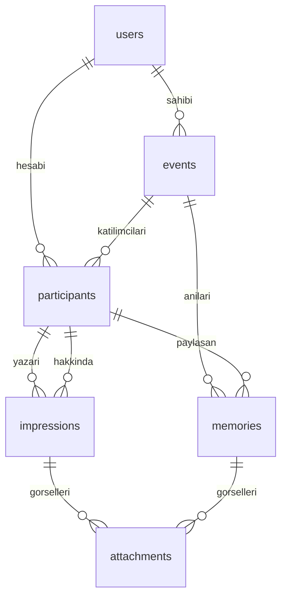

# Veri Modeli

Şemanın tek gerçek kaynağı. Migration eklendiğinde **aynı commit içinde** burası güncellenir.

**Son güncelleme:** 2026-08-29 (Faz 5)

## Genel şema

Aşağıda `Durum` kolonu her tablonun hangi fazda gerçekleştiğini gösterir.

## Tablolar

### `users` — Durum: Var (starter kit)

Fortify'dan geliyor, değiştirilmedi. `id`, `name`, `email`, `email_verified_at`, `password`,
iki faktörlü kimlik doğrulama kolonları, `remember_token`, zaman damgaları.

Bir `User` birden fazla etkinliğe katılabilir; her etkinlikteki kimliği ayrıdır (PRD 46).

### `events` — Durum: Faz 1

| Kolon                        | Tip                     | Not                                                     |
| ---------------------------- | ----------------------- | ------------------------------------------------------- |
| `id`                         | bigint, PK              |                                                         |
| `ulid`                       | string, unique          | Route key (D-007)                                       |
| `owner_id`                   | FK → `users.id`         | Etkinlik sahibi (PRD 5.1)                               |
| `name`                       | string                  |                                                         |
| `description`                | text                    | Kısa açıklama, zorunlu (PRD 6)                          |
| `long_description`           | text, nullable          |                                                         |
| `location`                   | string, nullable        |                                                         |
| `cover_image_path`           | string, nullable        | Faz 3'te doldurulur                                     |
| `starts_on`                  | date                    |                                                         |
| `ends_on`                    | date, nullable          | Yaklaşık bitiş olabilir (PRD 6)                         |
| `status`                     | string                  | `EventStatus`                                           |
| `impression_reveal_mode`     | string                  | `ImpressionRevealMode`, MVP'de hep `immediate` (PRD 24) |
| `reveal_at`                  | timestamp, nullable     | Gecikmeli açılış tarihi                                 |
| `allows_content_after_close` | boolean, default `true` | "Hatıralar açık" / "Yıllık kilitlendi" (PRD 33)         |
| `timestamps`                 |                         |                                                         |
| `deleted_at`                 | soft delete             |                                                         |

### `participants` — Durum: Faz 1

Etkinlik üyeliği **ve** etkinlik profili aynı kayıtta (D-003).

| Kolon        | Tip                                       | Not                                        |
| ------------ | ----------------------------------------- | ------------------------------------------ |
| `id`         | bigint, PK                                |                                            |
| `ulid`       | string, unique                            | Route key (D-007)                          |
| `event_id`   | FK → `events.id`, cascade delete          |                                            |
| `user_id`    | FK → `users.id`, nullable, null on delete | Davet kabul edilene kadar `null` (PRD 4.2) |
| `name`       | string                                    | Tek zorunlu alan (PRD 7)                   |
| `email`      | string, nullable                          | E-posta daveti için                        |
| `role`       | string                                    | `ParticipantRole`                          |
| `status`     | string                                    | `ParticipantStatus`                        |
| `photo_path` | string, nullable                          | Faz 3                                      |
| `bio`        | text, nullable                            | Faz 3, kısa etkinlik açıklaması (PRD 13)   |
| `links`      | json, nullable                            | Faz 3, sınırlı sosyal bağlantılar          |
| `timestamps` |                                           |                                            |

**Kısıtlar:**

- `unique(event_id, user_id)` — bir kullanıcı aynı etkinlikte iki kez bulunamaz.
- `unique(event_id, email)` — aynı e-posta aynı etkinliğe iki kez eklenemez.
- `index(event_id, status)` — katılımcı listeleri bu ikili üzerinden filtreleniyor.

`user_id` ve `email` birlikte `null` olabilir: hesabı olmayan, e-postası da bilinmeyen bir
katılımcı yalnızca isimle listede durabilir (PRD 7).

### `participants` davet kolonları — Durum: Faz 2

| Kolon                 | Tip                          | Not                                       |
| --------------------- | ---------------------------- | ----------------------------------------- |
| `invitation_token`    | string(64), unique, nullable | DB token; iptal edilince `null` (D-010)   |
| `invited_at`          | timestamp, nullable          | Son davet gönderimi; süre buradan (D-012) |
| `invitation_seen_at`  | timestamp, nullable          | Önizleme ilk görüntülendiğinde            |
| `joined_at`           | timestamp, nullable          | Davet kabul / sahip oluşturma             |
| `left_at`             | timestamp, nullable          | Faz 6                                     |
| `consent_accepted_at` | timestamp, nullable          | Rıza onayı; yoksa etkinlik 403            |

### `attachments` — Durum: Faz 3

Polymorphic görsel tablosu (D-005). Kapak ve profil fotoğrafı hâlâ `events.cover_image_path`
ve `participants.photo_path` üzerindedir; bu tablo izlenim/anı çoklu görselleri içindir.

| Kolon                        | Tip                               | Not                       |
| ---------------------------- | --------------------------------- | ------------------------- |
| `id`                         | bigint, PK                        |                           |
| `ulid`                       | string, unique                    |                           |
| `attachable_type` / `_id`    | morphs                            | Event, Impression, Memory |
| `disk`                       | string, default `public`          |                           |
| `path`                       | string                            | Tahmin edilemez dosya adı |
| `original_name`              | string                            |                           |
| `mime_type`                  | string                            |                           |
| `size`                       | unsigned int                      |                           |
| `position`                   | unsigned int                      |                           |
| `uploaded_by_participant_id` | FK → participants, null on delete |                           |

### `impressions` — Durum: Faz 4

| Kolon                      | Tip                                    | Not                                      |
| -------------------------- | -------------------------------------- | ---------------------------------------- |
| `id`                       | bigint, PK                             |                                          |
| `ulid`                     | string, unique                         | Route key (D-007)                        |
| `event_id`                 | FK → `events.id`, cascade delete       |                                          |
| `author_participant_id`    | FK → `participants.id`, cascade delete | Yazan katılımcı                          |
| `subject_participant_id`   | FK → `participants.id`, cascade delete | Hakkında yazılan katılımcı               |
| `body`                     | text                                   | Serbest metin                            |
| `shows_author_name`        | boolean, default `true`                | `false` ise izlenim isimsiz (PRD 18, 19) |
| `visible_from`             | timestamp, nullable                    | Gecikmeli açılış; MVP'de `null` (PRD 24) |
| `hidden_at`                | timestamp, nullable                    | Faz 6 gizleme                            |
| `hidden_by_participant_id` | FK → `participants.id`, null on delete | Faz 6 gizleyen                           |
| `timestamps`               |                                        |                                          |

**Kısıtlar:**

- `index(event_id, subject_participant_id, created_at)` — profil akışı.
- `index(event_id, author_participant_id, created_at)` — yazdıklarım.
- Yazar ≠ hakkında yazılan uygulama katmanında (PRD 62.6).
- Aynı ikili için sınırsız kayıt (PRD 62.7); yeni kayıt eskisini değiştirmez (D-004).
- Serileştirme yalnızca `ImpressionPresenter` üzerinden; isimsiz yazarda `author_*` prop'lara girmez.

### `memories` — Durum: Faz 5

| Kolon                      | Tip                                    | Not                                            |
| -------------------------- | -------------------------------------- | ---------------------------------------------- |
| `id`                       | bigint, PK                             |                                                |
| `ulid`                     | string, unique                         | Route key                                      |
| `event_id`                 | FK → `events.id`, cascade delete       |                                                |
| `participant_id`           | FK → `participants.id`, cascade delete | Paylaşan; adı her zaman görünür (PRD 26)       |
| `body`                     | text                                   |                                                |
| `occurred_on`              | date, nullable                         | Gerçek olay günü; aralık dışı olabilir (D-015) |
| `hidden_at`                | timestamp, nullable                    | Faz 6                                          |
| `hidden_by_participant_id` | FK → `participants.id`, null on delete | Faz 6                                          |
| `timestamps`               |                                        |                                                |

**Kısıtlar:** `index(event_id, occurred_on, created_at)`.

### `notifications` — Durum: Faz 5

Laravel standart bildirim tablosu. `users.notification_preferences` JSON
(`new_impression`, `new_memory`, `new_participant`) tercihleri tutar (D-016).

### `reports` — Durum: Faz 6

Polymorphic içerik bildirimi: `event_id`, `reportable_type` / `reportable_id`,
`reporter_participant_id`, `reason` (`ReportReason`), `note`, `status`
(`ReportStatus`: open/hidden/removed/dismissed), `resolved_by_participant_id`,
`resolved_at`. Aynı kişi aynı içeriği bir kez bildirebilir.

## Enum'lar

Hepsi `string`-backed, `app/Enums/` altında, key'ler TitleCase.

### `EventStatus`

PRD 32'deki yaşam döngüsü.

| Değer       | Anlam                                    |
| ----------- | ---------------------------------------- |
| `draft`     | Oluşturuldu, katılımcı hazırlığı sürüyor |
| `active`    | Etkinlik yaşanıyor, içerik üretiliyor    |
| `completed` | Etkinlik bitti, yıllık oluşturulabilir   |
| `archived`  | Ağırlıklı olarak geçmişe dönük okunuyor  |

### `ParticipantRole`

| Değer         | Anlam                                   |
| ------------- | --------------------------------------- |
| `owner`       | Etkinlik sahibi (PRD 5.1)               |
| `moderator`   | Yer tutucu; MVP'de arayüz yok (PRD 5.3) |
| `participant` | Katılımcı (PRD 5.2)                     |

### `ParticipantStatus`

PRD 9'un yedi durumu. Tamamının arayüzde gösterilmesi zorunlu değil, ancak sistem ayırt edebilmeli.

| Değer                 | Anlam                           |
| --------------------- | ------------------------------- |
| `not_invited`         | Listede var, davet gönderilmedi |
| `invited`             | Davet gönderildi                |
| `invitation_seen`     | Davet görüntülendi              |
| `invitation_accepted` | Davet kabul edildi              |
| `active`              | Katılımcı aktif                 |
| `left`                | Etkinlikten ayrıldı             |
| `invitation_revoked`  | Davet iptal edildi              |

`active` ve `invitation_accepted` ayrımı: kabul anı ile ilk profil oluşturma arasındaki durumu
ayırt etmek için tutuluyor.

### `ImpressionRevealMode`

PRD 24. MVP'de yalnızca `immediate` kullanılır; `at_event_end` veri modelinde hazır.

| Değer          | Anlam                                                      |
| -------------- | ---------------------------------------------------------- |
| `immediate`    | Yayınlandığı anda görünür                                  |
| `at_event_end` | `reveal_at` tarihine kadar diğer katılımcılara gösterilmez |

## Bilinçli tasarım kararları

- **Her içerik bir etkinliğe ait** (PRD 62.1). `impressions` ve `memories` tabloları
  `participants` üzerinden dolaylı erişilebilir olsa da `event_id` doğrudan taşınır;
  etkinlik kapsamlı sorgular join gerektirmiyor.
- **İçerik `participants`'a bağlanır, `users`'a değil.** Kullanıcı hesabını silse bile
  yıllığın tarihsel bütünlüğü korunur (PRD 47).
- **Gizleme silme değildir.** `hidden_at` ile kaldırma ayrı davranışlar (PRD 39).
