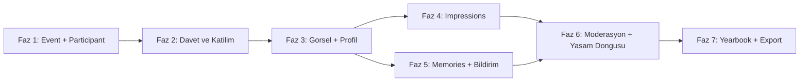

# Yol Haritası

**Ürün:** Etkinlik tabanlı sosyal hatıra ve ilk izlenim uygulaması
**Kaynak:** [`../prd.md`](../prd.md)
**Son güncelleme:** 2026-08-29

## Neden tek faz değil

PRD'nin yalnızca MVP listesi (bölüm 58) 25 özellik içeriyor: etkinlik yönetimi, hesap eşleştirmeli
davet sistemi, görsel yükleme, zaman katmanlı impression modeli, görünürlük kuralları, moderasyon,
yıllık görünümü ve kalıcı dışa aktarım. Başlangıç noktası ise tek `User` modeli olan çıplak bir
Laravel 13 + Inertia v3 + Fortify starter kit.

Tek fazda gitmek, sonuna kadar çalışan hiçbir şey üretmeyen tek bir dev diff anlamına gelir.
Bu yüzden iş, **her biri kendi başına kullanılabilir bir dilim bırakan** 7 faza bölündü.
Her faz kendi `phase-NN-slug` branch'inde yapılır; `composer ci:check` ve Bugbot temiz
kalınca `main`'e birleşir (D-009). Sonraki faz kullanıcı söyleyene kadar açılmaz.

## Faz durumları

| Faz | Ad                                                                                          | Durum      | Başlangıç  | Bitiş      |
| --- | ------------------------------------------------------------------------------------------- | ---------- | ---------- | ---------- |
| 1   | [Türkçeleştirme temeli + Event/Participant çekirdeği](phases/phase-01-event-core.md)        | Tamamlandı | 2026-08-29 | 2026-08-29 |
| 2   | [Davet ve katılıma bağlanma](phases/phase-02-invitations.md)                                | Tamamlandı | 2026-08-29 | 2026-08-29 |
| 3   | [Görsel altyapısı, etkinlik profili, katılımcılar alanı](phases/phase-03-profiles-media.md) | Tamamlandı | 2026-08-29 | 2026-08-29 |
| 4   | [Impressions](phases/phase-04-impressions.md)                                               | Tamamlandı | 2026-08-29 | 2026-08-29 |
| 5   | [Memories, içerik akışı, bildirimler](phases/phase-05-memories-feed.md)                     | Tamamlandı | 2026-08-29 | 2026-08-29 |
| 6   | [Moderasyon, gizleme, etkinlik yaşam döngüsü](phases/phase-06-moderation-lifecycle.md)      | Tamamlandı | 2026-08-29 | 2026-08-29 |
| 7   | [Yearbook ve kalıcı dışa aktarım](phases/phase-07-yearbook.md)                              | Tamamlandı | 2026-08-29 | 2026-08-29 |

Durum değerleri: `Planlandı` · `Devam ediyor` · `Tamamlandı` · `Askıya alındı`

## Faz bağımlılıkları

Faz 4 ve Faz 5 birbirine bağlı değil; Faz 3 bittikten sonra sırası değiştirilebilir.

## Faz özetleri

### Faz 1 — Türkçeleştirme temeli + Event/Participant çekirdeği

Ürünün iskeleti. Etkinlik ve katılımcı kayıtları, etkinlik kapsamlı yetkilendirme,
ve tüm arayüzün Türkçeye geçişi.

PRD: 4.1, 4.2, 5.1, 6, 7, 9, 45, 46, 62

### Faz 2 — Davet ve katılıma bağlanma

Katılımcıya özel davet token'ı, e-posta daveti, davet bağlantısı sayfası ve daveti kabul eden
kullanıcının önceden hazırlanmış `Participant` kaydıyla eşleştirilmesi. Rıza ve içerik kuralları onayı.

PRD: 8, 9, 42, 43, 62.3-62.4

### Faz 3 — Görsel altyapısı, etkinlik profili, katılımcılar alanı

Polymorphic görsel altyapısı (sonraki tüm fazlar buna dayanıyor), etkinlik kapak görseli,
katılımcı etkinlik profili, katılımcılar grid'i ve etkinlik ana sayfası.

PRD: 4.5, 10, 11, 12, 13, 29

### Faz 4 — Impressions

Ürünün kalbi. Aynı kişi hakkında zaman içinde çoklu kayıt, isimli/isimsiz görünürlük tercihi,
yazım yönlendirmeleri, üç ayrı görünüm (hakkımda / benim yazdıklarım / başkaları hakkında).

PRD: 4.3, 14-24, 50, 54, 56

### Faz 5 — Memories, içerik akışı, bildirimler

Kişiye değil etkinliğe bağlı anılar, kronolojik gezinme, sade içerik akışı ve rahatsız etmeyen bildirimler.

PRD: 4.4, 25-28, 30, 31, 52

### Faz 6 — Moderasyon, gizleme, etkinlik yaşam döngüsü

İçerik bildirme, kendi hakkındaki içeriği gizleme, sahip moderasyonu, etkinlik kapanışı,
arşiv, sahiplik devri ve etkinlikten ayrılma kuralları.

PRD: 32, 33, 39, 40, 41, 44, 47, 48

### Faz 7 — Yearbook ve kalıcı dışa aktarım

Event Yearbook ve My Yearbook görünümleri; yazdırma odaklı CSS ile kalıcı PDF çıktısı.
Dışa aktarım web görünürlük kurallarını birebir uygular.

PRD: 34-38, 62.20-62.21

## Kapsam dışı (PRD 59)

Bu fazların hiçbirinde yapılmayacaklar:

reaction, yorum dizileri, kullanıcılar arası mesajlaşma, arkadaşlık/takip, puanlama, gelişmiş
analytics, sosyal network grafikleri, popülerlik sıralamaları, public etkinlikler, herkese açık
yıllık bağlantıları, video yükleme, gelişmiş galeri, yüz tanıma, AI özet üretimi, otomatik sosyal
medya postları, akademik raporlama.

Ayrıca MVP dışına alınanlar:

- Ayrı **Event Moderator** rolü (PRD 5.3) — yetki `ParticipantRole` enum'unda yer tutuyor, arayüz yok.
- Etkinliğe özel **terminoloji kişiselleştirme** (PRD 55).
- **Gecikmeli impression açılışı** (PRD 24) — veri modeli destekliyor, MVP'de yalnızca anında görünürlük.
